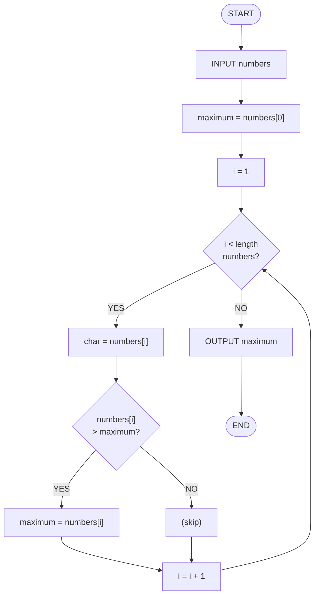
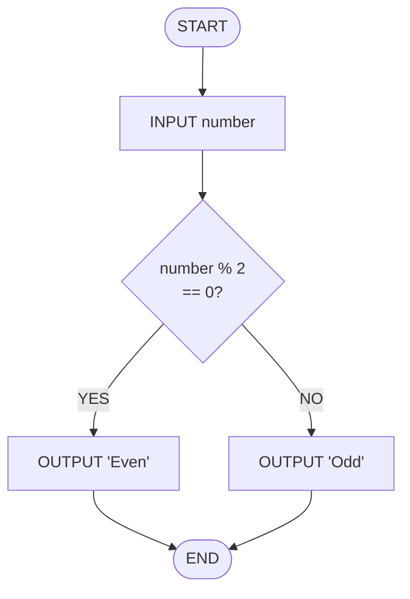
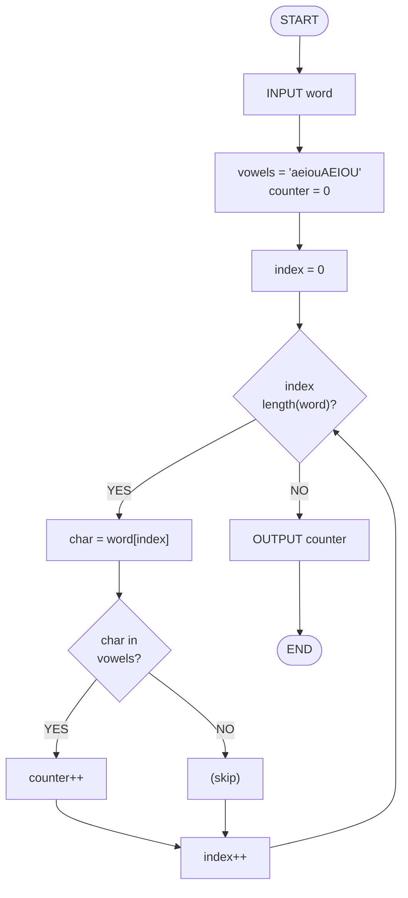

# Chapter 6: Computational Thinking

## Introduction: The Foundation of Programming

**Programming is not about code.**

This might sound strange. You are learning to program. Surely programming is about code?

No. Code is a tool. Programming is about thinking.

When you sit down to solve a problem, you do not start by opening a text editor. You do not immediately start typing. You start by *thinking through the problem*. You break it down. You recognize patterns. You abstract away irrelevant details. You design a step-by-step solution.

**This process—this way of thinking—is called computational thinking.**

Computational thinking is not specific to programming. It is not even specific to computers. It is a general approach to problem-solving that happens to be particularly effective for problems that can be solved by computers.

But more importantly, **computational thinking is what separates programmers who can only solve problems they have seen before from programmers who can solve novel problems.**

This chapter teaches you to think computationally. We will not write code yet. We will use pseudocode (English-like instructions) and flowcharts (visual diagrams). The goal is to develop your problem-solving process before you worry about syntax.

---

## Part 1: Understanding the Problem

### The Overlooked First Step

You would think this is obvious: before you solve a problem, you should understand it.

Yet it is the most commonly skipped step.

Beginning programmers often read a problem, scan it quickly, and immediately start writing code. They assume they understand. They do not. When the code does not work, they blame the programming language.

The problem was not the language. The problem was that they did not actually understand what they were trying to solve.

**Computational thinking begins with deep problem understanding.**

### Asking the Right Questions

When you encounter a problem, you must ask systematic questions:

**Question 1: What exactly is the problem asking?**

Read the problem description carefully. Do not assume you understand. Ask:
- What is the input? (What information am I given?)
- What is the output? (What should the result be?)
- What is the goal? (What should change or be produced?)

Example problem: "Write a program that finds the average of a list of numbers."

Input: A list of numbers
Output: A single number (the average)
Goal: Calculate and return the average

**Question 2: What are the constraints?**

Constraints are limitations or restrictions:
- How many numbers will be in the list?
- Can the numbers be negative?
- Should the result be exact or rounded?
- Are there performance requirements?

For the average problem:
- Can the list be empty? (If so, what should we return?)
- Can numbers be decimals?
- Should we round the average?

**Question 3: What are the edge cases?**

Edge cases are unusual inputs that might behave differently:
- Empty list
- Single item
- Negative numbers
- Very large numbers
- Decimal numbers

For the average problem:
- What if the list is empty?
- What if the list has only one number?
- What if all numbers are negative?

**Question 4: What examples can I think of?**

Examples concretize the problem:

Good example: [2, 4, 6] → average is 4
Good example: [1] → average is 1
Good example: [1.5, 2.5, 3.5] → average is 2.5

Edge case example: [] → What should this return?

**Question 5: Have I seen a similar problem?**

Pattern recognition starts here:
- Is this similar to something I have solved before?
- What was that solution?
- Can I adapt that approach?

### The Understanding Checklist

Before you design a solution, verify that you understand:

- [ ] I can explain the problem in my own words
- [ ] I know what the input is
- [ ] I know what the output should be
- [ ] I can create 3-5 examples of input and output
- [ ] I can identify at least one edge case
- [ ] I can explain what constraints might apply
- [ ] I can recall a similar problem I have solved

If you cannot check all of these, you do not yet understand the problem. Go back and ask more questions.

---

## Part 2: Decomposition

### Breaking Down Complexity

**Decomposition is the process of breaking a complex problem into smaller, simpler problems.**

The idea is simple: a large problem is hard to solve. A small problem is easy to solve. Therefore, break the large problem into small problems, solve each one, and combine the solutions.

This is not a programming technique. It is a universal problem-solving strategy.

When you cook a meal, you decompose it:
- Main dish
- Side dish
- Dessert
- Cleanup

You do not think about "cook a meal" all at once. You think about each piece.

When you build a house, you decompose it:
- Foundation
- Frame
- Roof
- Walls
- Electrical
- Plumbing

When you organize an event, you decompose it:
- Venue
- Catering
- Invitations
- Schedule
- Logistics

### How Decomposition Works in Programming

Let's decompose the "find the average" problem:

**Problem**: Find the average of a list of numbers

**Decomposition**:
1. Get the sum of all numbers
2. Count how many numbers there are
3. Divide the sum by the count
4. Return the result

Each of these is simpler than the original problem.

Let's decompose further:

**Step 1: Get the sum of all numbers**
- Start with a total of 0
- For each number in the list, add it to the total
- Return the total

**Step 2: Count how many numbers there are**
- This is straightforward: the length of the list

**Step 3: Divide the sum by the count**
- Take the result from step 1
- Take the result from step 2
- Divide one by the other

**Step 4: Return the result**
- Give the result to the caller

### Decomposition Trees

You can visualize decomposition as a tree:

```
Find Average
├── Sum Numbers
│   ├── Initialize total to 0
│   ├── For each number
│   │   └── Add to total
│   └── Return total
├── Count Numbers
│   └── Get length of list
├── Divide Sum by Count
│   ├── Get sum
│   ├── Get count
│   └── Calculate sum / count
└── Return Result
```

Each node in the tree represents a task. The top node is the overall problem. The leaf nodes are simple tasks that are straightforward to implement.

### The Benefits of Decomposition

Why decompose? Several reasons:

1. **Simplicity**: Small problems are easier to think about than large problems.

2. **Testability**: You can test each sub-problem independently. If step 1 works and step 2 works, but the result is wrong, you know the problem is in step 3.

3. **Reusability**: "Sum a list of numbers" is a useful sub-problem that appears in many contexts. Once you solve it, you can use it again.

4. **Team collaboration**: Different people can work on different sub-problems simultaneously.

5. **Debugging**: When something goes wrong, you can narrow down where the problem is.

6. **Understanding**: When you come back to this code a year later, you can understand it one piece at a time rather than trying to hold the entire problem in your head.

---

## Part 3: Pattern Recognition

### Identifying Similarities

**Pattern recognition is the process of identifying similarities between problems.**

After you decompose a problem, look at the sub-problems. Do any of them look similar? Do any of them follow the same structure?

Example: Suppose you are processing a list of students. You might need to:
- Find the total age of all students
- Find the total grade of all students
- Find the total tuition of all students

These are three different problems. But they follow the same pattern:
- Start with a total of 0
- For each student, add the relevant value to the total
- Return the total

This is the **accumulation pattern**. Once you recognize it, you can solve all three problems using the same approach.

### Common Programming Patterns

Here are some patterns you will encounter repeatedly:

**The Accumulation Pattern**
- Start with an initial value (often 0)
- For each item in a collection, combine it with the accumulator
- Return the final value

Examples: Sum, average, concatenating strings, finding maximum

**The Filtering Pattern**
- Start with an empty collection
- For each item in the original collection, check a condition
- If the condition is true, add it to the new collection
- Return the new collection

Examples: Find all numbers greater than 10, find all students with grade A, find all even numbers

**The Transformation Pattern**
- Start with an empty collection
- For each item in the original collection, transform it in some way
- Add the transformed item to the new collection
- Return the new collection

Examples: Convert all temperatures to Celsius, square all numbers, extract names from student objects

**The Search Pattern**
- Start at the beginning of a collection
- For each item, check if it matches what we are looking for
- If it matches, return it (or its position)
- If we reach the end without finding it, return not-found

Examples: Find a student by ID, find the first even number, find a word in a list

**The Recursive Pattern**
- Break a problem into a smaller version of the same problem
- Have a base case that stops the recursion
- Have a recursive case that makes progress toward the base case

Examples: Factorial, Fibonacci, searching a tree

### Building a Pattern Library

As you solve more problems, you build a mental library of patterns. When you encounter a new problem, you ask: "Have I seen a pattern like this before?"

If yes, you can adapt that pattern instead of designing from scratch.

This is why experienced programmers solve problems faster than beginners. Not because they are smarter. Because they have seen more patterns.

---

## Part 4: Abstraction

### Ignoring Irrelevant Details

**Abstraction is the process of removing unnecessary details and focusing on what is important for solving the problem.**

Imagine you are writing instructions for making coffee. You might think:
- Use a coffee maker
- Put water in the reservoir
- Put ground coffee in the filter
- Plug in the machine
- Wait

But you do not need to explain:
- How electricity flows through the heating element
- The exact molecular structure of water
- How pressure builds up in the machine

These are true facts about coffee-making, but they are not relevant to someone who just wants to make coffee.

This is abstraction. You are hiding details that are not relevant to the current task.

### Abstraction in Programming

In programming, abstraction works the same way. When you use a function, you do not need to know how it works internally. You only need to know:
- What inputs it accepts
- What output it produces

Example: Suppose there is a function that finds the sum of a list. You do not need to know:
- Whether it uses a loop or recursion
- What variable names it uses internally
- How the computer stores the numbers in memory

You only need to know:
- Input: a list of numbers
- Output: the sum

This abstraction allows you to think at a higher level. You do not get bogged down in implementation details.

### Levels of Abstraction

Most problems exist at multiple levels of abstraction:

**Level 1 (High Abstraction)**: "Find the average of a list"
- This is what a user cares about

**Level 2**: Decompose into: sum the numbers, count them, divide
- This is what a programmer designing the solution cares about

**Level 3**: Implement the sum function
- This is what a programmer implementing that function cares about

**Level 4**: Implement using a loop that increments a counter and adds to a total
- This is what a programmer thinking about specific logic cares about

**Level 5**: The CPU executes individual machine instructions
- This is what the computer cares about

Each level hides the complexity of the level below it. When you are thinking at Level 1, you do not worry about Level 5. When you are implementing at Level 3, you do not worry about Level 4 until you need to.

This is why abstraction is powerful: it lets you focus on one thing at a time.

---

## Part 5: Algorithms

### From Design to Steps

**An algorithm is a step-by-step procedure for solving a problem.**

An algorithm is not code. It is not specific to any programming language. It is a description of steps that could be executed by a human, a computer, or even a robot.

A recipe is an algorithm. Driving directions are an algorithm. A dance choreography is an algorithm.

An algorithm is:
- Precise (each step is clear)
- Unambiguous (there is no confusion about what to do)
- Complete (all steps needed are included)
- Terminates (the process has an end)

### Designing Algorithms

Once you have understood the problem, decomposed it, recognized patterns, and abstracted away irrelevant details, you design an algorithm.

**Example: Finding the maximum number in a list**

**Algorithm (in English)**:
1. Assume the first number is the maximum
2. For each remaining number:
   a. If this number is greater than the current maximum, update the maximum
3. Return the maximum

**Algorithm (in Pseudocode)**:

```
FUNCTION FindMaximum(numbers)
    maximum = numbers[0]
    FOR each number in numbers (starting from index 1)
        IF number > maximum
            maximum = number
        END IF
    END FOR
    RETURN maximum
END FUNCTION
```

**Algorithm (in Flowchart)**:



---

## Part 6: Pseudocode and Flowcharts

### Pseudocode

Pseudocode is a simplified, English-like way of writing algorithms. It is not valid code in any programming language, but it looks similar enough that it is easy to translate to actual code.

Benefits of pseudocode:
- Easy to read and understand
- Language-independent
- Focuses on logic, not syntax
- Can be discussed and reviewed before coding
- Easier to catch errors

Structure of pseudocode:
- Use simple English words (IF, WHILE, FOR)
- Indent to show structure
- Use simple variable names
- Use mathematical notation where appropriate

Example (pseudocode for sorting):

```
FUNCTION BubbleSort(array)
    n = length(array)
    FOR i = 0 to n-1
        FOR j = 0 to n-i-2
            IF array[j] > array[j+1]
                temp = array[j]
                array[j] = array[j+1]
                array[j+1] = temp
            END IF
        END FOR
    END FOR
    RETURN array
END FUNCTION
```

### Flowcharts

A flowchart is a visual representation of an algorithm using shapes and arrows.

**Flowchart Symbols**:
- Oval (START, END)
- Rectangle (process/action)
- Diamond (decision/condition)
- Arrow (flow direction)
- Parallelogram (input/output)

**Example (flowchart for finding if a number is even)**:



---

## Part 7: The Full Problem-Solving Cycle

### A Complete Framework

Now that you understand the individual pieces, let's see how they fit together. This is the full problem-solving cycle:

**Step 1: UNDERSTAND**
- What is the problem asking?
- What are the inputs and outputs?
- What are the constraints and edge cases?
- Can I think of examples?
- Have I seen a similar problem?

**Step 2: DECOMPOSE**
- Break the problem into sub-problems
- Create a decomposition tree
- Ensure each sub-problem is simpler than the whole

**Step 3: RECOGNIZE PATTERNS**
- Look at the sub-problems
- Are any of them similar?
- Can I reuse or adapt a known pattern?
- Can I generalize the solution?

**Step 4: ABSTRACT**
- What details are irrelevant?
- What can I hide or ignore?
- What are the essential components?
- How do the pieces fit together?

**Step 5: DESIGN ALGORITHM**
- Write the algorithm in English
- Convert to pseudocode
- Create a flowchart
- Review for correctness
- Check for edge cases

**Step 6: IMPLEMENT**
- Translate pseudocode to code
- Test with examples
- Test with edge cases
- Debug if necessary

**Step 7: REVIEW**
- Does the solution solve the original problem?
- Is the solution efficient?
- Is the code readable?
- What did I learn?
- How can I apply this to future problems?

### Complete Example: Counting Vowels

Let's walk through a complete problem using this cycle.

**Problem**: Write a program that counts the number of vowels in a word.

#### Step 1: UNDERSTAND

- **Input**: A word (string)
- **Output**: A number (count of vowels)
- **Vowels**: A, E, I, O, U (and lowercase versions)
- **Edge cases**:
  - Empty string
  - String with no vowels
  - String with all vowels
  - Mixed case

- **Examples**:
  - "hello" → 2 (e, o)
  - "programming" → 3 (o, a, i)
  - "" → 0
  - "xyz" → 0

#### Step 2: DECOMPOSE

```
Count Vowels in Word
├── For each character in the word
│   └── Check if it is a vowel
│       └── If yes, increment counter
└── Return counter
```

#### Step 3: RECOGNIZE PATTERNS

This follows the **counting pattern**:
- Start with a counter at 0
- For each item in a collection
- If the item meets a condition, increment the counter
- Return the counter

Similar problems: Count numbers greater than 10, count students with grade A

#### Step 4: ABSTRACT

- We do not care how the word is stored (array, linked list, etc.)
- We do not care what the original purpose of the word is
- We only care that we can iterate through characters and check if each is a vowel

#### Step 5: DESIGN ALGORITHM

**In English**:
1. Create a counter starting at 0
2. For each character in the word
3. Check if the character is a vowel (A, E, I, O, U, a, e, i, o, u)
4. If it is a vowel, increment the counter
5. After checking all characters, return the counter

**In Pseudocode**:

```
FUNCTION CountVowels(word)
    vowels = "aeiouAEIOU"
    counter = 0
    
    FOR each character in word
        IF character is in vowels
            counter = counter + 1
        END IF
    END FOR
    
    RETURN counter
END FUNCTION
```

**In Flowchart**:



#### Step 6: IMPLEMENT

Now you would translate the pseudocode to actual C++ code. (But we are not doing that yet in this chapter.)

#### Step 7: REVIEW

- Does it solve the original problem? Yes.
- Is it efficient? Yes, it checks each character once.
- Is it readable? Yes, the variable names are clear.
- What did I learn? The counting pattern is useful for many problems.
- How can I apply this? I could count consonants, count specific letters, etc.

---

## Part 8: Common Pitfalls

### Pitfall 1: Skipping Problem Understanding

**The Trap**: You read the problem quickly and start coding immediately.

**The Problem**: You build a solution to the wrong problem. When it does not work, you blame the language.

**The Fix**: Before you design anything, write down:
- What is the input?
- What is the output?
- What are the constraints?
- What are 3-5 examples?

### Pitfall 2: Trying to Solve Everything at Once

**The Trap**: You try to design the entire solution in your head without decomposing.

**The Problem**: The solution is too complex to fit in your head. You miss cases. You make mistakes.

**The Fix**: Break it down. Even if a sub-problem seems small, decompose it. The discipline of decomposition prevents errors.

### Pitfall 3: Not Recognizing Patterns

**The Trap**: You solve a problem, then encounter a very similar problem and design from scratch again.

**The Problem**: You waste time on problems you have essentially already solved.

**The Fix**: After solving a problem, ask: "What pattern did I use?" Keep a mental note of patterns. When you see a new problem, ask: "Have I seen a pattern like this?"

### Pitfall 4: Getting Lost in Details

**The Trap**: While designing the algorithm, you get stuck on implementation details. "How do I store this?" "What data structure should I use?"

**The Problem**: You never finish the design because you are distracted.

**The Fix**: During design, abstract away details. Use generic terms like "a collection" instead of "an array." Use pseudocode instead of real code. Implementation decisions come later.

### Pitfall 5: Designing Without Examples

**The Trap**: You design an algorithm and move directly to coding.

**The Problem**: You do not have concrete test cases. When it does not work, you do not know if the problem is in your design or your implementation.

**The Fix**: Before implementing, trace through your algorithm with examples. Manually execute your pseudocode with test inputs. If it produces the right output for your examples, the algorithm is probably correct.

---

## Part 9: Building Your Computational Thinking Skills

### Practice Deliberate Decomposition

For every problem you encounter, practice decomposing it fully:

- Write down the main problem
- Decompose into sub-problems
- Decompose those further
- Continue until you have simple, manageable pieces

Do this with problems that are not even programming problems:
- How would you organize a family reunion?
- How would you plan a road trip?
- How would you teach someone to bake a cake?

### Keep a Pattern Journal

When you solve a problem:
1. Note the pattern you used
2. Note an example of that pattern
3. Note other contexts where you might use this pattern

Over time, you build a rich library of patterns you can recognize.

### Use Pseudocode and Flowcharts

Before you write a single line of code, design in pseudocode and/or flowcharts.

This discipline forces you to think clearly before you code. It catches errors before you have to debug.

### Think in Levels of Abstraction

When you are designing an algorithm, think in English first. Then pseudocode. Never jump directly to code.

When you are implementing, think in pseudocode. Then code. Never skip the intermediate step.

This progression forces clarity at each level.

### Verify Edge Cases

For every algorithm you design, ask: What could go wrong?

Think through edge cases:
- Empty input
- Single item
- Extreme values
- Invalid input

Update your algorithm to handle these cases.

---

## Part 10: Reflection Questions

As you finish this chapter, sit with these questions:

### On Problem Understanding

1. **When you read a problem, what is your first impulse?** Do you immediately start coding? Do you take time to understand first?

2. **Can you articulate the difference between "input," "output," and "process"?** Can you identify these for a problem you are trying to solve?

3. **What edge cases are you currently missing?** When you design a solution, what unusual cases do you not think about?

### On Decomposition

4. **How deep do you decompose?** Do you decompose until each piece is simple, or do you stop earlier?

5. **Can you visualize decomposition?** Can you draw a decomposition tree for a problem?

6. **How comfortable are you with breaking problems into pieces?** Does it feel natural, or is it something you have to force?

### On Pattern Recognition

7. **What patterns have you recognized so far?** Can you name three patterns you have seen in problems?

8. **When you encounter a new problem, do you ask "Have I seen something like this before?"** If not, can you practice this question?

9. **Do you keep track of patterns?** A journal, a note, a mental library?

### On Abstraction

10. **When you are solving a problem, do you get distracted by irrelevant details?** What details do you tend to fixate on?

11. **Can you describe a problem at a high level, ignoring implementation?** Can you say "This is really just accumulation" without thinking about loops or data structures?

12. **How comfortable are you with layers of abstraction?** Can you think about a problem at multiple levels?

### On Algorithms

13. **Can you design an algorithm in pseudocode without falling into code syntax?** Do you find yourself writing `for (int i = 0; i < n; i++)` when you should write `FOR each item`?

14. **When you create a flowchart, does it help you think?** Or does it feel like a distraction?

15. **Do you trace through your algorithm with examples?** Before implementing, do you manually execute your pseudocode?

---

## Summary

**Computational thinking is the foundation of programming.**

The process consists of:

1. **Understanding**: Deeply grasping what the problem is asking
2. **Decomposition**: Breaking complex problems into simpler pieces
3. **Pattern Recognition**: Identifying similarities and reusing solutions
4. **Abstraction**: Focusing on essential details and ignoring irrelevant ones
5. **Algorithm Design**: Creating step-by-step procedures
6. **Implementation**: Translating algorithms to code
7. **Review**: Reflecting on the solution and learning from it

These steps are not specific to C++. They apply to every programming problem, in every language, forever.

The best programmers are not the ones who know the most syntax or the most libraries. They are the ones who can think computationally: who can break down problems, recognize patterns, and design solutions.

Learn to think computationally, and you can learn any programming language. Skip this, and you will struggle forever.

---

## Looking Forward

In the next chapter, we will explore **Debugging as a Core Skill**—how to systematically diagnose and fix broken code.

But before you move forward, practice the computational thinking process on problems you encounter. Do not jump to code. Design first. Think first. Code second.

The discipline of thinking before coding is what separates programmers from people who happen to know programming syntax.

Be a programmer. [Degugging as a Core Skill](./07-debugging-as-core-skill.md)
